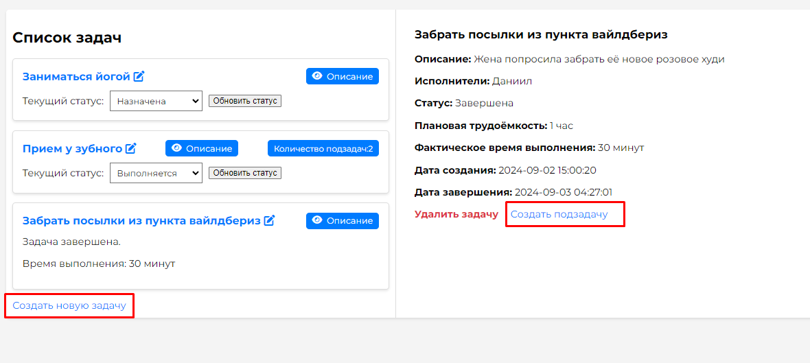

Этот проект представляет собой веб-приложение для управления задачами, созданное с использованием Django. 
Для запуска проекта в Docker-контейнере следуйте этим инструкциям.

## Требования

- Docker
- Docker Compose

1. Клонируйте репозиторий на вашу локальную машину:

`git clone https://github.com/ushakovda/task_manager`  
`cd <папка-с-проектом>`

2. Запустите проект `docker compose up` 
* чтобы остановить проект - `docker compose down`

Проект будет доступен по адресу http://localhost:8000. Откройте браузер на весь экран.
Ради примера сохранена БД sqlite, при необходимости файл db.sqlite3 можно удалить.

Инструкция к пользованию:

 - Задачи можно создать, нажав на кнопку "Создать новую задачу", а также внутри описания основной задачи, нажав на кнопку "Создать подзадачу".

 - Если у задачи есть подзадачи, её нельзя удалить или завершить. В таком случае появится кнопка "Количество подзадач:". Нажав на неё, вы увидите список всех подзадач в виде плоского списка.
 - Задачу можно удалить через детальную форму описания задачи.
 - Смена статусов осуществляется прямо в списке задач. Страница не обновляется при смене статуса. Если вы попытаетесь выполнить недопустимый переход (например, из статуса "Назначена" сразу в статус "Завершена"), система выдаст предупреждение.
 - Чтобы отредактировать задачу, нажмите на её название в списке задач.
 - Для получения подробной информации о задаче используйте кнопку "Описание". Это реализовано с помощью AJAX-запросов, что позволяет отображать информацию без необходимости обновления страницы. 

### Технологии

- **Python:** Основной язык программирования для разработки серверной логики.
- **Django:** Основной фреймворк для создания веб-приложений.
- **Docker:** Платформа для создания и управления контейнерами.
- **SQLite:** Встраиваемая база данных для примеров и тестирования.
- **JavaScript:** Используется для динамического взаимодействия с пользователем и обработки событий на стороне клиента.
- **AJAX:** Асинхронные запросы для обновления информации на странице без ее перезагрузки.
- **HTML/CSS:** Основные технологии для создания и стилизации веб-страниц.

*Дата завершения отображается после обновления страницы/повторного открытия страницы описания конкретной задачи. Время завершения также отобразится после обновления - в списке задач